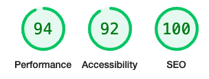

# Frontend Developer Test

## Setup

### How to run in your local

```
npm install
npm run dev
```

Then visit http://localhost:3000

### How to run the "built" production on a server

1. Paste contents of the dist folder on a web server
2. Visit index.html

## Features

1. Hamburger menu on mobile
2. Responsive slider auto-playing
3. Mobile and tablet responsive page
4. Uses Tailwind CSS
5. Production build's assets are minified
6. Production build's CSS files are purged leading to just 3kb when gzipped
7. Lighthouse: 100 score on SEO, high scores on Performance and Accessibility


